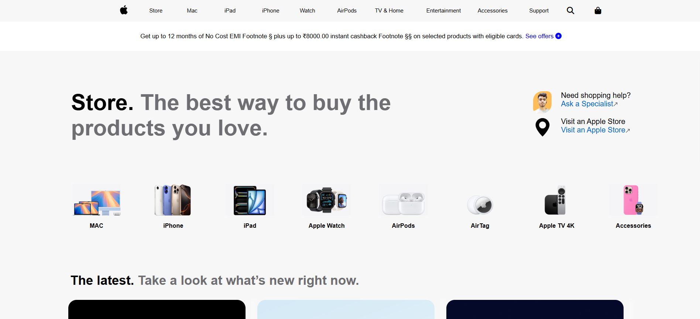
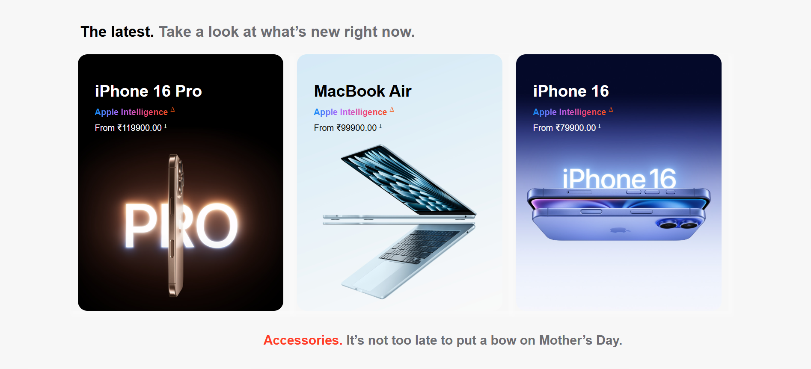
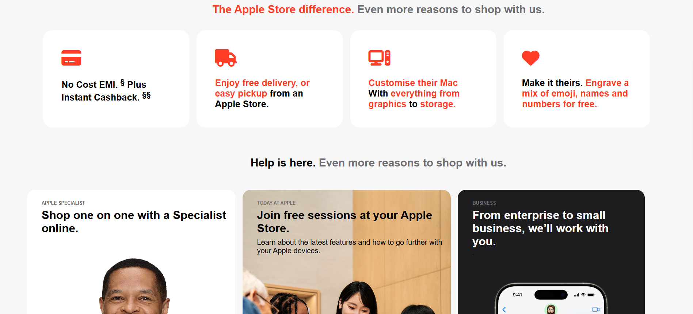
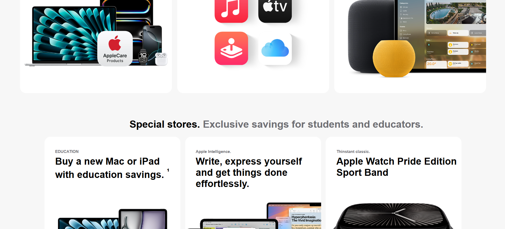
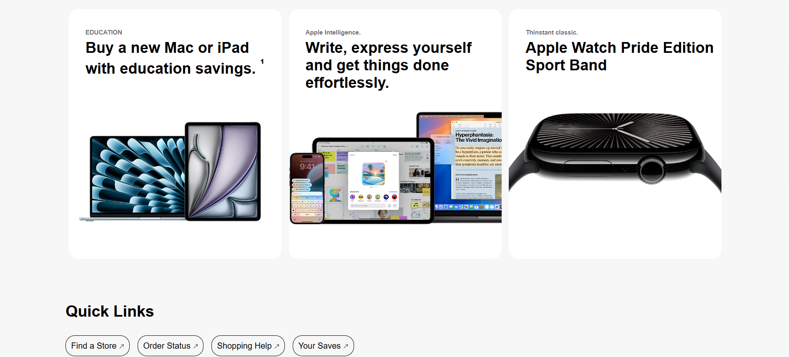
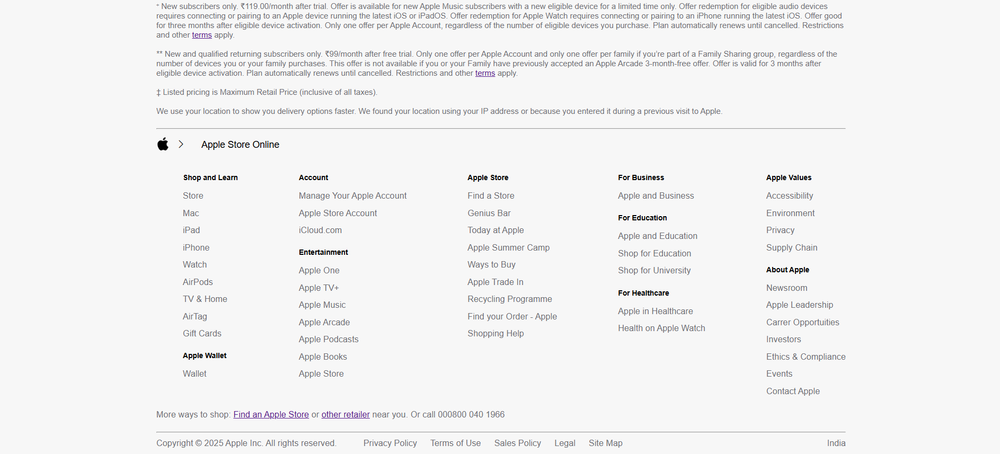

# Apple Store Clone (HTML & CSS Only)

This is a **static clone** of the Apple official homepage (apple.com), created for **hands-on HTML and CSS practice**. The layout is designed for **laptop/desktop view only** and focuses purely on structure and styling — no JavaScript or responsiveness.

---

## 📌 Project Purpose

- Practice HTML & CSS layout skills
- Understand real-world webpage structuring
- Recreate a real-world UI (Apple homepage) 
- Improve design understanding and attention to detail
- Recreate a clean and professional UI without using JavaScript

---

## 🛠️ Technologies Used

- HTML5  
- CSS3  
- Font Awesome (for icons)  
- Bootstrap Icons

---

### 🖼️ Home Page








---

## 📂 Files Included

├── index.html
├── style.css
└── /assets (optional: images or icons)

---

## 🚀 How to View

1. Clone this repo:
   ```bash
   git clone https://github.com/yourusername/apple-store-clone-html-css.git


---

## ⚠️ Notes

- 💻 This webpage is **not responsive** — built only for desktop/laptop screen sizes.
- 🎯 Focused on **layout and styling**, not functionality.

---

## 🙋‍♂️ Author

**Jaykant Yadav**  
CSE Student | Frontend Practice

---

## 📝 License

For learning and portfolio use only. Not for commercial use.
